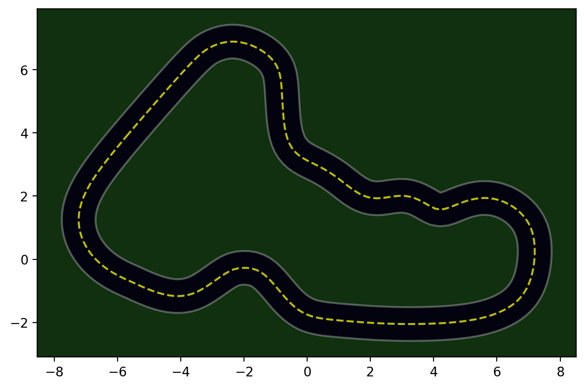
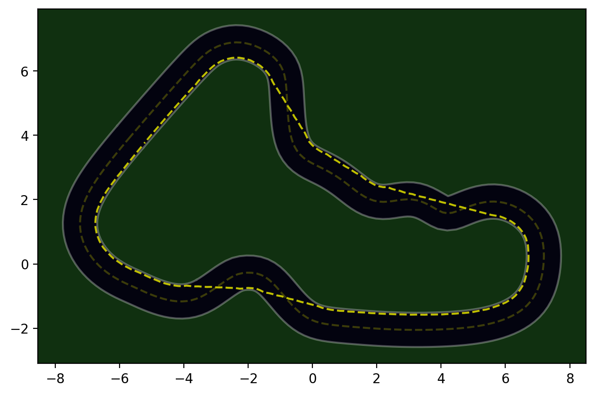
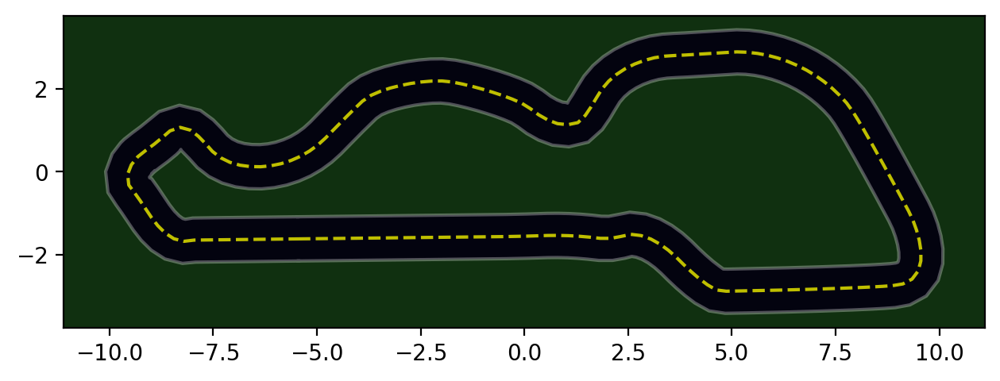
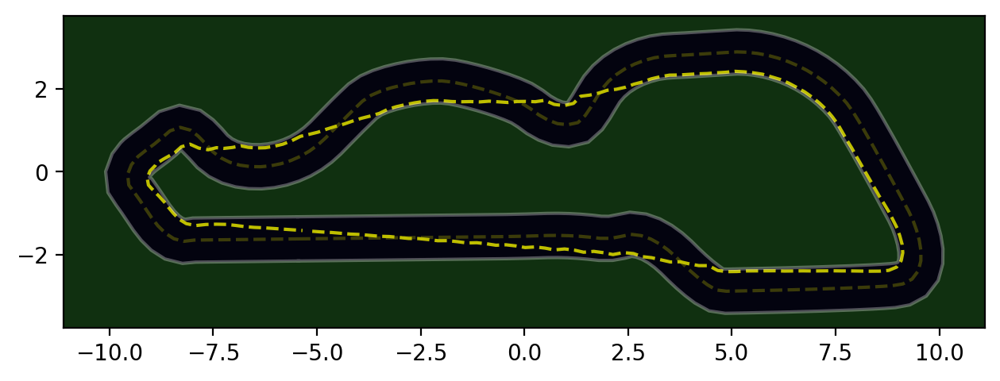
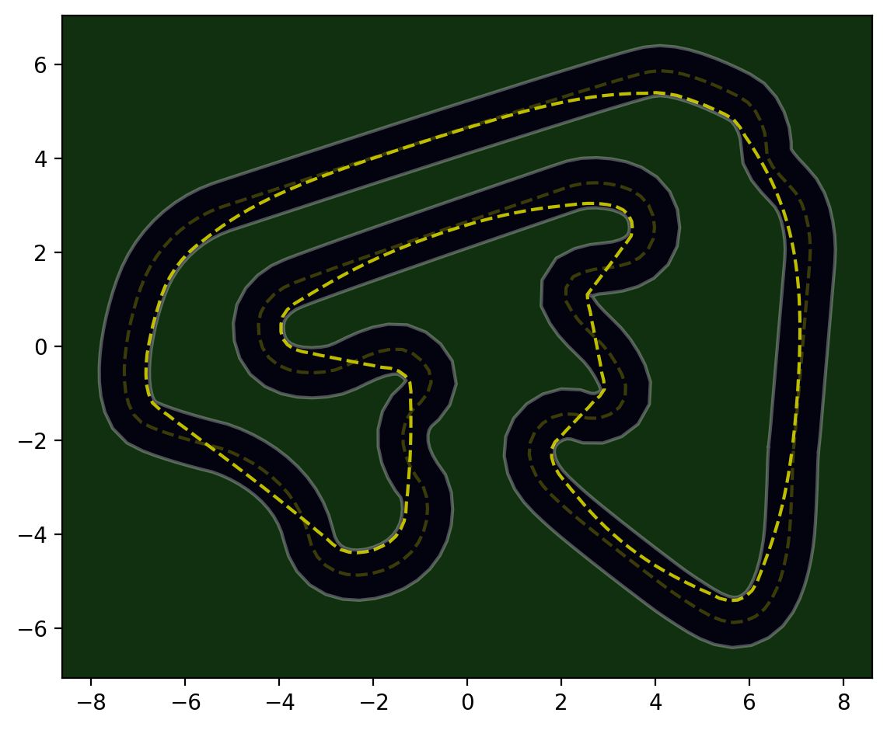

# AWS Deep Racer Worksheet

## Racing line calculation and visualisation

The objective is to smooth central line of a given track. This is achieved by minimising the distance between each pair
 of two closes waypoints. Selected closes waypoints are not always the nearest waypoints, such as between a pair of
 selected waypoints, there might be others waypoints located closer. However, these are still close enough to be used.
 This is controlled by skipp_step parameter, which allows acceleration of the algorithm. The optimisation algorithm
 takes into account track's inner and outer borders to ensure that new calculated waypoints do not touch the borders or
 go beyond the borders or located too close to the borders. This is controlled by  max_offset parameter.

This algorithm does not search for an optimal arc of corners to race at the maximum possible speed for a given steering.

### Sample Results 
| Original Track | Race Line v1 | Race Line v2 | Race Line v3 |
|----------------|--------------|--------------|--------------|
|  |  |  |  |
|  |  |  |  |
|  |  |  |  |


## Reward Function

Rewards calculation is based on a number of conditional points, which are all configurable. Sum of all conditional
points contributes to the final score. Conditional points also have sensitivity parameter to control rewards curve. 

#### The points are:
1. Rewards the agent for being on or close enough (configurable) to the racing line.
1. Rewards the agent for taking an action which gets the car closer to the next waypoint on the racing line. 
1. Reward the agent on having high _steps-to-progress_ ratio. Simply saying: reward on good progress.
1. Reward the agent on moving in high speed (regardless of track conditions).
1. Reward the agent on moving straight, rather than making turns (regardless of track conditions).

#### Sample reward weights
```python
REWARD_WEIGHT_PROG_STEP = 30
REWARD_WEIGHT_MAX_SPEED = 25
REWARD_WEIGHT_MIN_STEER = 20
REWARD_WEIGHT_DIR_STEER = 15
REWARD_WEIGHT_ON_TRACK = 10
```

In addition to contributing criteria points, there are 4 types of penalty indicators which reduce the total calculates 
score. The effectiveness of every penalty indicator is configurable in percentage terms, expect for the
"**Wheels Off Track**" penalty. It has penalty weight of 100% percent and decay over number of steps (configurable).
#### The penalties are:
1. Penalty to overall score in percentage for being off or far from racing line.
2. Penalty to taking turn (having steering) which takes the car further away from the next waypoint on the racing line. 
3. Penalty for taking sharp turn / having high steering (regardless of track conditions).
4. Penalty for having at least one  wheel off track.

#### Sample penalty weights
````python
MAX_STEPS_TO_DECAY_PENALTY = 5      # Value of zero or below disables penalty for having wheels off track

TOTAL_PENALTY_ON_OFF_TRACK = 0.999999  # Maximum penalty in percentage of total reward for being off track
TOTAL_PENALTY_ON_OFF_DIR_STEER = 0.50  # Maximum penalty in percentage of total reward for off directional steering
TOTAL_PENALTY_ON_HIGH_STEERING = 0.25  # Maximum penalty in percentage of total reward for high steering
````

## Other Useful Repositories to look at
1. [AWS DeepRacer League (https://aws.amazon.com/deepracer/league/)](https://aws.amazon.com/deepracer/league/)
2. [DeepRacer Logs Analysis tools (https://github.com/aws-deepracer-community/deepracer-analysis)](https://github.com/aws-deepracer-community/deepracer-analysis)
3. [AWS Deepracer Workshop Lab Github (https://github.com/aws-samples/aws-deepracer-workshops)](https://github.com/aws-samples/aws-deepracer-workshops)
4. [DeepRacer K1999 Racing Line Algo (https://github.com/cdthompson/deepracer-k1999-race-lines)](https://github.com/cdthompson/deepracer-k1999-race-lines)
5. [DeepRacer Utils CLI commands (https://github.com/aws-deepracer-community/deepracer-utils)](https://github.com/aws-deepracer-community/deepracer-utils)

## License
```
MIT License

Copyright (c) 2021 AWS DeepRacer Worksheet contributors community

Permission is hereby granted, free of charge, to any person obtaining a copy
of this software and associated documentation files (the "Software"), to deal
in the Software without restriction, including without limitation the rights
to use, copy, modify, merge, publish, distribute, sublicense, and/or sell
copies of the Software, and to permit persons to whom the Software is
furnished to do so, subject to the following conditions:

The above copyright notice and this permission notice shall be included in all
copies or substantial portions of the Software.

THE SOFTWARE IS PROVIDED "AS IS", WITHOUT WARRANTY OF ANY KIND, EXPRESS OR
IMPLIED, INCLUDING BUT NOT LIMITED TO THE WARRANTIES OF MERCHANTABILITY,
FITNESS FOR A PARTICULAR PURPOSE AND NONINFRINGEMENT. IN NO EVENT SHALL THE
AUTHORS OR COPYRIGHT HOLDERS BE LIABLE FOR ANY CLAIM, DAMAGES OR OTHER
LIABILITY, WHETHER IN AN ACTION OF CONTRACT, TORT OR OTHERWISE, ARISING FROM,
OUT OF OR IN CONNECTION WITH THE SOFTWARE OR THE USE OR OTHER DEALINGS IN THE
SOFTWARE.
```